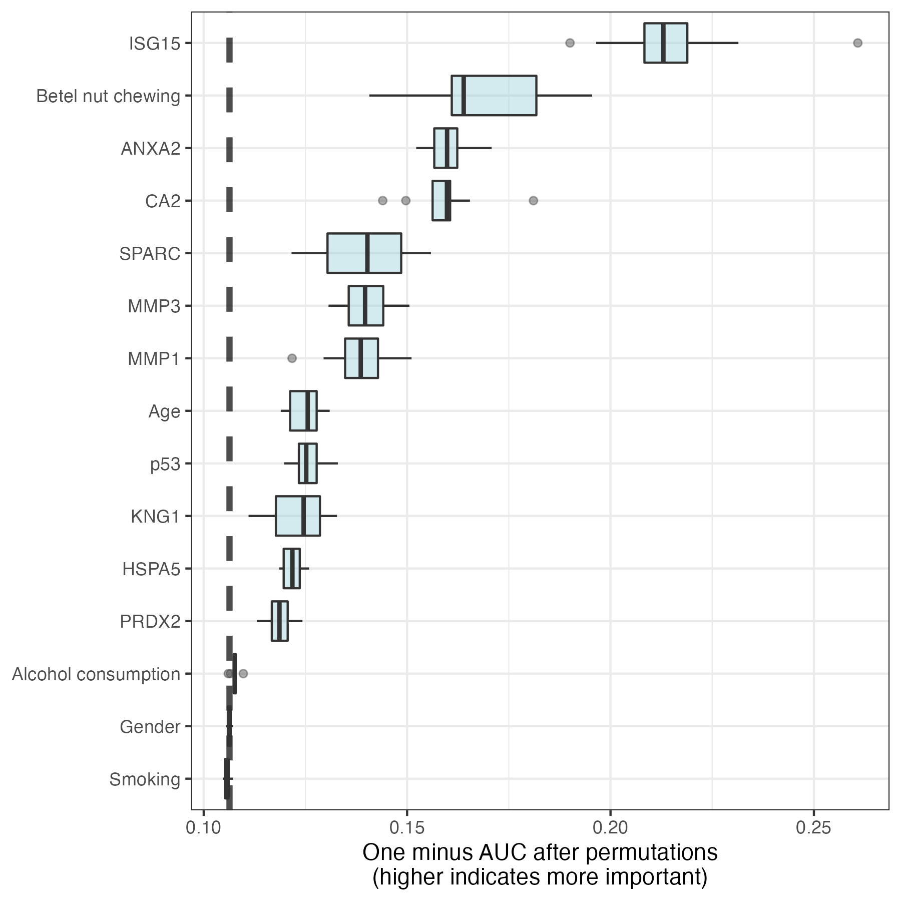

Machine Learning–Based Risk Prediction Models of Oral Squamous Cell Carcinoma Using Salivary Autoantibody Biomarkers
================
Yi-Ju Tseng, Yi-Cheng Wang, Pei-Chun Hsueh and Chih-Ching Wu

## Load packages and data

``` r
source("libAndData.R")
SeedList <- c(4321:4420)
```

## Data process and model development

Parallel processing

``` r
cpu.core<-parallel::detectCores()
cl <- makeCluster(cpu.core)
registerDoParallel(cl)
```

### Data processing strategy 1 (MFI : Original; Age : Original)

``` r
AutoAb$Age<- AutoAb$AgeOri
```

``` r
xgb_model <- map(SeedList, function(x) xgb_result(AutoAb,x,FALSE))
RF_model <- map(SeedList, function(x) RF_result(AutoAb,x,FALSE))
LR_model <- map(SeedList, function(x) LR_result(AutoAb,x,FALSE))
svm_model <- map(SeedList, function(x) svm_result(AutoAb,x,FALSE))
```

``` r
stk_model <- map(SeedList, function(x) stk_result(AutoAb,x,FALSE))
```

``` r
resultOutput(xgb_model,"XGBoost","OO")
resultOutput(RF_model,"RF","OO")
resultOutput(LR_model,"LR","OO")
resultOutput(svm_model,"SVM","OO")
resultOutput(stk_model,"Stacking","OO")
```

### Data processing strategy 2 (MFI : Original; Age : Binary)

Convert age to binary format

``` r
AutoAb$Age<- AutoAb$AgeB 
```

``` r
xgb_model <- map(SeedList, function(x) xgb_result(AutoAb,x,FALSE))
RF_model <- map(SeedList, function(x) RF_result(AutoAb,x,FALSE))
LR_model <- map(SeedList, function(x) LR_result(AutoAb,x,FALSE))
svm_model <- map(SeedList, function(x) svm_result(AutoAb,x,FALSE))
```

``` r
stk_model <- map(SeedList, function(x) stk_result(AutoAb,x,FALSE))
```

``` r
resultOutput(xgb_model,"XGBoost","OB")
resultOutput(RF_model,"RF","OB")
resultOutput(LR_model,"LR","OB")
resultOutput(svm_model,"SVM","OB")
resultOutput(stk_model,"Stacking","OB")
```

### Data processing strategy 3 (MFI : Original; Age : Ternary)

Convert age to ternary format

``` r
AutoAb$Age<- AutoAb$AgeT
```

``` r
xgb_model <- map(SeedList, function(x) xgb_result(AutoAb,x,FALSE))
RF_model <- map(SeedList, function(x) RF_result(AutoAb,x,FALSE))
LR_model <- map(SeedList, function(x) LR_result(AutoAb,x,FALSE))
svm_model <- map(SeedList, function(x) svm_result(AutoAb,x,FALSE))
```

``` r
stk_model <- map(SeedList, function(x) stk_result(AutoAb,x,FALSE))
```

``` r
resultOutput(xgb_model,"XGBoost","OT")
resultOutput(RF_model,"RF","OT")
resultOutput(LR_model,"LR","OT")
resultOutput(svm_model,"SVM","OT")
resultOutput(stk_model,"Stacking","OT")
```

### Data processing strategy 4 (MFI : Binary; Age : Original)

``` r
AutoAb$Age<- AutoAb$AgeOri 
```

``` r
xgb_model <- map(SeedList, function(x) xgb_result(AutoAb,x,TRUE))
RF_model <- map(SeedList, function(x) RF_result(AutoAb,x,TRUE))
LR_model <- map(SeedList, function(x) LR_result(AutoAb,x,TRUE))
svm_model <- map(SeedList, function(x) svm_result(AutoAb,x,TRUE))
```

``` r
stk_model <- map(SeedList, function(x) stk_result(AutoAb,x,TRUE))
```

``` r
resultOutput(xgb_model,"XGBoost","BO")
resultOutput(RF_model,"RF","BO")
resultOutput(LR_model,"LR","BO")
resultOutput(svm_model,"SVM","BO")
resultOutput(stk_model,"Stacking","BO")
```

### Data processing strategy 5 (MFI : Binary; Age : Binary)

Convert age to binary format

``` r
AutoAb$Age<- AutoAb$AgeB
```

``` r
xgb_model <- map(SeedList, function(x) xgb_result(AutoAb,x,TRUE))
RF_model <- map(SeedList, function(x) RF_result(AutoAb,x,TRUE))
LR_model <- map(SeedList, function(x) LR_result(AutoAb,x,TRUE))
svm_model <- map(SeedList, function(x) svm_result(AutoAb,x,TRUE))
```

``` r
stk_model <- map(SeedList, function(x) stk_result(AutoAb,x,TRUE))
```

``` r
resultOutput(xgb_model,"XGBoost","BB")
resultOutput(RF_model,"RF","BB")
resultOutput(LR_model,"LR","BB")
resultOutput(svm_model,"SVM","BB")
resultOutput(stk_model,"Stacking","BB")
```

### Data processing strategy 6 (MFI : Binary; Age : Ternary)

Convert age to ternary format

``` r
AutoAb$Age <- AutoAb$AgeT # Age = ternary
```

``` r
xgb_model <- map(SeedList, function(x) xgb_result(AutoAb,x,TRUE))
RF_model <- map(SeedList, function(x) RF_result(AutoAb,x,TRUE))
LR_model <- map(SeedList, function(x) LR_result(AutoAb,x,TRUE))
svm_model <- map(SeedList, function(x) svm_result(AutoAb,x,TRUE))
```

``` r
stk_model <- map(SeedList, function(x) stk_result(AutoAb,x,TRUE))
```

``` r
resultOutput(xgb_model,"XGBoost","BT")
resultOutput(RF_model,"RF","BT")
resultOutput(LR_model,"LR","BT")
resultOutput(svm_model,"SVM","BT")
resultOutput(stk_model,"Stacking","BT")
```

### Data processing strategy 7 (MFI : Logarithm; Age : Original) - Best approach

Use common log-transformed MFI level

``` r
AutoAb$Age<- AutoAb$AgeOri 

AutoAb$ANXA2 <- AutoAb$ANXA2Log
AutoAb$CA2 <- AutoAb$CA2Log
AutoAb$HSPA5 <- AutoAb$HSPA5Log
AutoAb$ISG15 <- AutoAb$ISG15Log
AutoAb$KNG1 <- AutoAb$KNG1Log
AutoAb$MMP1 <- AutoAb$MMP1Log
AutoAb$MMP3 <- AutoAb$MMP3Log
AutoAb$p53 <- AutoAb$p53Log
AutoAb$PRDX2 <- AutoAb$PRDX2Log
AutoAb$SPARC <- AutoAb$SPARCLog #log10
```

``` r
xgb_model <- map(SeedList, function(x) xgb_result(AutoAb,x,FALSE))
RF_model <- map(SeedList, function(x) RF_result(AutoAb,x,FALSE))
LR_model <- map(SeedList, function(x) LR_result(AutoAb,x,FALSE))
svm_model <- map(SeedList, function(x) svm_result(AutoAb,x,FALSE))
```

``` r
stk_model <- map(SeedList, function(x) stk_result(AutoAb,x,FALSE))
```

``` r
resultOutput(xgb_model,"XGBoost","LO")
resultOutput(RF_model,"RF","LO")
resultOutput(LR_model,"LR","LO")
resultOutput(svm_model,"SVM","LO")
resultOutput(stk_model,"Stacking","LO")
```

#### Lift plot

``` r
stk_perf<-map_dfr(stk_model,3)
stk_perf$Seed<-1:length(SeedList)
stk_perf$realSeed<-SeedList
bestSeed<-stk_perf %>% arrange(desc(ROC)) %>% pull(Seed)
bestRealSeed<-stk_perf %>% arrange(desc(ROC)) %>% pull(realSeed)
print(paste0("The best seed: ",bestRealSeed[1]))
```

    ## [1] "The best seed: 4388"

``` r
lift_results<-data.frame(Class=stk_model[[bestSeed[1]]]$Tst$Diagnosis,
                         XGBoost=xgb_model[[bestSeed[1]]]$Tst$H,
                         RF=RF_model[[bestSeed[1]]]$Tst$H,
                         SVM=svm_model[[bestSeed[1]]]$Tst$H,
                         LR=LR_model[[bestSeed[1]]]$Tst$H,
                         Stacking=stk_model[[bestSeed[1]]]$Tst$.pred_H)
lift_results$Class<-factor(lift_results$Class,levels = c("H","L"))
trellis.par.set(caretTheme())
lift_obj <- caret::lift(Class ~ XGBoost + RF + SVM+LR+Stacking, data = lift_results)
GainLO<-ggplot(lift_obj)+theme_bw()
ggsave("GainLO.pdf",plot=GainLO,device="pdf",width = 7,height = 5)

LiftLO<-ggplot(lift_obj$data) +
  geom_line(aes(CumTestedPct, lift, color = liftModelVar))+
  geom_hline(yintercept = 1, linetype='dotted')+
  theme_bw()+
  labs(color="Methods",x="% Tested",y="Lift")
ggsave("LiftLO.pdf",plot=LiftLO,device="pdf",width = 7,height = 5)

two_class_lift <- lift_results %>% 
  pivot_longer(XGBoost:Stacking) %>%
  group_by(name)%>%
  lift_curve(Class, value) 
lift_data<-two_class_lift %>%
  group_by(name,.percent_tested = cut_interval(.percent_tested, n = 10)) %>%
  summarise(.lift = mean(.lift, na.rm = TRUE)) 
lift_data %>% filter(.percent_tested=="[0,10]") %>% knitr::kable()
```

| name     | .percent_tested |    .lift |
|:---------|:----------------|---------:|
| LR       | \[0,10\]        | 1.789474 |
| RF       | \[0,10\]        | 1.789474 |
| Stacking | \[0,10\]        | 1.789474 |
| SVM      | \[0,10\]        | 1.789474 |
| XGBoost  | \[0,10\]        | 1.789474 |

``` r
lift_data %>%
  ggplot(aes(.percent_tested, .lift)) +
  geom_col() +
  geom_hline(yintercept = 1, linetype='dotted')+
  theme_bw() +
  facet_grid(name~.)+
  labs(x = "% Tested", y = "Lift") #Sup Figure 2
```

<!-- -->

``` r
ggsave("LiftLOBar.pdf",device="pdf",width = 8,height = 6)
```

#### Calibration curve

``` r
trellis.par.set(caretTheme())
cal_obj <- calibration(Class ~ XGBoost + RF + SVM+LR+Stacking,
                       data = lift_results,
                       cuts = 7)
pdf("CalLO.pdf",width = 7,height = 5)
plot(cal_obj, type = "l", auto.key = list(columns = 4,
                                          lines = TRUE,
                                          points = FALSE))
dev.off() 
```

    ## quartz_off_screen 
    ##                 2

``` r
plot(cal_obj, type = "l", auto.key = list(columns = 4,
                                          lines = TRUE,
                                          points = FALSE)) #Sup Figure 1
```

<!-- -->

#### Brier Score

``` r
o_t = 2-as.numeric(lift_results$Class)
data.frame(Algorithm=c("Stacking","XGBoost","Random Forest","SVM","Logistic Regression"),
           BrierScore=c(mean((lift_results$Stacking - o_t)^2),
                        mean((lift_results$XGBoost - o_t)^2),
                        mean((lift_results$RF - o_t)^2),
                        mean((lift_results$SVM - o_t)^2),
                        mean((lift_results$LR - o_t)^2))) %>%
  mutate(BrierScore=round(BrierScore,3)) %>%
  knitr::kable()
```

| Algorithm           | BrierScore |
|:--------------------|-----------:|
| Stacking            |      0.125 |
| XGBoost             |      0.123 |
| Random Forest       |      0.151 |
| SVM                 |      0.140 |
| Logistic Regression |      0.127 |

### Data processing strategy 8 (MFI : Logarithm; Age : Binary)

Convert age to binary format and use common log-transformed MFI level

``` r
AutoAb$Age<- AutoAb$AgeB
AutoAb$ANXA2 <- AutoAb$ANXA2Log
AutoAb$CA2 <- AutoAb$CA2Log
AutoAb$HSPA5 <- AutoAb$HSPA5Log
AutoAb$ISG15 <- AutoAb$ISG15Log
AutoAb$KNG1 <- AutoAb$KNG1Log
AutoAb$MMP1 <- AutoAb$MMP1Log
AutoAb$MMP3 <- AutoAb$MMP3Log
AutoAb$p53 <- AutoAb$p53Log
AutoAb$PRDX2 <- AutoAb$PRDX2Log
AutoAb$SPARC <- AutoAb$SPARCLog #log10
```

``` r
xgb_model <- map(SeedList, function(x) xgb_result(AutoAb,x,FALSE))
RF_model <- map(SeedList, function(x) RF_result(AutoAb,x,FALSE))
LR_model <- map(SeedList, function(x) LR_result(AutoAb,x,FALSE))
svm_model <- map(SeedList, function(x) svm_result(AutoAb,x,FALSE))
```

``` r
stk_model <- map(SeedList, function(x) stk_result(AutoAb,x,FALSE))
```

``` r
resultOutput(xgb_model,"XGBoost","LB")
resultOutput(RF_model,"RF","LB")
resultOutput(LR_model,"LR","LB")
resultOutput(svm_model,"SVM","LB")
resultOutput(stk_model,"Stacking","LB")
```

### Data processing strategy 9 (MFI : Logarithm; Age : Ternary)

Convert age to ternary format and use common log-transformed MFI level

``` r
AutoAb$Age <- AutoAb$AgeT # Age = ternary
AutoAb$ANXA2 <- AutoAb$ANXA2Log
AutoAb$CA2 <- AutoAb$CA2Log
AutoAb$HSPA5 <- AutoAb$HSPA5Log
AutoAb$ISG15 <- AutoAb$ISG15Log
AutoAb$KNG1 <- AutoAb$KNG1Log
AutoAb$MMP1 <- AutoAb$MMP1Log
AutoAb$MMP3 <- AutoAb$MMP3Log
AutoAb$p53 <- AutoAb$p53Log
AutoAb$PRDX2 <- AutoAb$PRDX2Log
AutoAb$SPARC <- AutoAb$SPARCLog #log10
```

``` r
xgb_model <- map(SeedList, function(x) xgb_result(AutoAb,x,FALSE))
RF_model <- map(SeedList, function(x) RF_result(AutoAb,x,FALSE))
LR_model <- map(SeedList, function(x) LR_result(AutoAb,x,FALSE))
svm_model <- map(SeedList, function(x) svm_result(AutoAb,x,FALSE))
```

``` r
stk_model <- map(SeedList, function(x) stk_result(AutoAb,x,FALSE))
```

``` r
resultOutput(xgb_model,"XGBoost","LT")
resultOutput(RF_model,"RF","LT")
resultOutput(LR_model,"LR","LT")
resultOutput(svm_model,"SVM","LT")
resultOutput(stk_model,"Stacking","LT")
```

### Data processing strategy 10 (MFI : Standardized; Age : Original)

Standardize MFI level

``` r
AutoAb$Age<- AutoAb$AgeOri 
AutoAb$ANXA2 <- AutoAb$ANXA2Std
AutoAb$CA2 <- AutoAb$CA2Std
AutoAb$HSPA5 <- AutoAb$HSPA5Std
AutoAb$ISG15 <- AutoAb$ISG15Std
AutoAb$KNG1 <- AutoAb$KNG1Std
AutoAb$MMP1 <- AutoAb$MMP1Std
AutoAb$MMP3 <- AutoAb$MMP3Std
AutoAb$p53 <- AutoAb$p53Std
AutoAb$PRDX2 <- AutoAb$PRDX2Std
AutoAb$SPARC <- AutoAb$SPARCStd #scale
```

``` r
xgb_model <- map(SeedList, function(x) xgb_result(AutoAb,x,FALSE))
RF_model <- map(SeedList, function(x) RF_result(AutoAb,x,FALSE))
LR_model <- map(SeedList, function(x) LR_result(AutoAb,x,FALSE))
svm_model <- map(SeedList, function(x) svm_result(AutoAb,x,FALSE))
```

``` r
stk_model <- map(SeedList, function(x) stk_result(AutoAb,x,FALSE))
```

``` r
resultOutput(xgb_model,"XGBoost","SO")
resultOutput(RF_model,"RF","SO")
resultOutput(LR_model,"LR","SO")
resultOutput(svm_model,"SVM","SO")
resultOutput(stk_model,"Stacking","SO")
```

### Data processing strategy 11 (MFI : Standardized; Age : Binary)

Convert age to binary format and standardize MFI level

``` r
AutoAb$Age<- AutoAb$AgeB
AutoAb$ANXA2 <- AutoAb$ANXA2Std
AutoAb$CA2 <- AutoAb$CA2Std
AutoAb$HSPA5 <- AutoAb$HSPA5Std
AutoAb$ISG15 <- AutoAb$ISG15Std
AutoAb$KNG1 <- AutoAb$KNG1Std
AutoAb$MMP1 <- AutoAb$MMP1Std
AutoAb$MMP3 <- AutoAb$MMP3Std
AutoAb$p53 <- AutoAb$p53Std
AutoAb$PRDX2 <- AutoAb$PRDX2Std
AutoAb$SPARC <- AutoAb$SPARCStd #scale
```

``` r
xgb_model <- map(SeedList, function(x) xgb_result(AutoAb,x,FALSE))
RF_model <- map(SeedList, function(x) RF_result(AutoAb,x,FALSE))
LR_model <- map(SeedList, function(x) LR_result(AutoAb,x,FALSE))
svm_model <- map(SeedList, function(x) svm_result(AutoAb,x,FALSE))
```

``` r
stk_model <- map(SeedList, function(x) stk_result(AutoAb,x,FALSE))
```

``` r
resultOutput(xgb_model,"XGBoost","SB")
resultOutput(RF_model,"RF","SB")
resultOutput(LR_model,"LR","SB")
resultOutput(svm_model,"SVM","SB")
resultOutput(stk_model,"Stacking","SB")
```

### Data processing strategy 12 (MFI : Standardized; Age : Ternary)

Convert age to ternary format and standardize MFI level

``` r
AutoAb$Age <- AutoAb$AgeT # Age = ternary
AutoAb$ANXA2 <- AutoAb$ANXA2Std
AutoAb$CA2 <- AutoAb$CA2Std
AutoAb$HSPA5 <- AutoAb$HSPA5Std
AutoAb$ISG15 <- AutoAb$ISG15Std
AutoAb$KNG1 <- AutoAb$KNG1Std
AutoAb$MMP1 <- AutoAb$MMP1Std
AutoAb$MMP3 <- AutoAb$MMP3Std
AutoAb$p53 <- AutoAb$p53Std
AutoAb$PRDX2 <- AutoAb$PRDX2Std
AutoAb$SPARC <- AutoAb$SPARCStd #scale
```

``` r
xgb_model <- map(SeedList, function(x) xgb_result(AutoAb,x,FALSE))
RF_model <- map(SeedList, function(x) RF_result(AutoAb,x,FALSE))
LR_model <- map(SeedList, function(x) LR_result(AutoAb,x,FALSE))
svm_model <- map(SeedList, function(x) svm_result(AutoAb,x,FALSE))
```

``` r
stk_model <- map(SeedList, function(x) stk_result(AutoAb,x,FALSE))
```

``` r
resultOutput(xgb_model,"XGBoost","ST")
resultOutput(RF_model,"RF","ST")
resultOutput(LR_model,"LR","ST")
resultOutput(svm_model,"SVM","ST")
resultOutput(stk_model,"Stacking","ST")
```

### Use patient characteristic alone to build model (MFI : Logarithm; Age : Original)

Use common log-transformed MFI level

``` r
AutoAb$Age<- AutoAb$AgeOri 

AutoAb$ANXA2 <- AutoAb$ANXA2Log
AutoAb$CA2 <- AutoAb$CA2Log
AutoAb$HSPA5 <- AutoAb$HSPA5Log
AutoAb$ISG15 <- AutoAb$ISG15Log
AutoAb$KNG1 <- AutoAb$KNG1Log
AutoAb$MMP1 <- AutoAb$MMP1Log
AutoAb$MMP3 <- AutoAb$MMP3Log
AutoAb$p53 <- AutoAb$p53Log
AutoAb$PRDX2 <- AutoAb$PRDX2Log
AutoAb$SPARC <- AutoAb$SPARCLog #log10
```

``` r
stk_model <- map(SeedList, function(x) stk_result_ponly(AutoAb,x,FALSE))
```

``` r
resultOutput(stk_model,"Stacking","LOPatient")
```

Stop parallel processing:

``` r
stopCluster(cl)
```

## Performance analysis

### Load performance data

``` r
source("Performance.R")
PF <- read.csv("Performance_all.csv")
PF$Algorithm <- factor(PF$Algorithm, levels = c("LR", "RF", "SVM", "XGBoost", "DNN", "Stacking"))
PF$Seed <- factor(PF$Seed)
PF$MFI <- factor(PF$MFI,levels=c("Original","Binary","Logarithmic","Standardized"))
PF$Age <- factor(PF$Age,levels=c("Original","Binary","Ternary"))
```

### Table. Performance metrics

``` r
Perf<-
  PF %>% group_by(Algorithm,MFI,Age) %>%
  summarise(Count=n(),AUC=mean(ROC),AUC_sd=sd(ROC),
            Sen=mean(Sensitivity),Sen_sd=sd(Sensitivity),
            Spe=mean(Specificity),Spe_sd=sd(Specificity),
            PPV_=mean(PPV),PPV_sd=sd(PPV),
            NPV_=mean(NPV),NPV_sd=sd(NPV))%>%
  mutate(AUCPrint=paste0(round(AUC,3),"|",round(AUC_sd,3)),# ± 
         SensitivityPrint=paste0(round(Sen,3),"|",round(Sen_sd,3)),
         SpecificityPrint=paste0(round(Spe,3),"|",round(Spe_sd,3)),
         PPVPrint=paste0(round(PPV_,3),"|",round(PPV_sd,3)),
         NPVPrint=paste0(round(NPV_,3),"|",round(NPV_sd,3)))
write.csv(Perf,"FinalPerfTable.csv")
FinalPerfTableWide<-Perf %>% dplyr::select(Algorithm,MFI,Age,AUCPrint)%>%
  pivot_wider(id_cols = c("MFI","Age"),names_from = "Algorithm",values_from = "AUCPrint") 
FinalPerfTableWide%>%  write.csv("FinalPerfTableWide.csv") 
FinalPerfTableWide%>%knitr::kable() #Sup Table 3
```

| MFI          | Age      | LR           | RF           | SVM          | XGBoost      | Stacking     |
|:-------------|:---------|:-------------|:-------------|:-------------|:-------------|:-------------|
| Original     | Original | 0.778\|0.054 | 0.762\|0.057 | 0.76\|0.053  | 0.777\|0.052 | 0.789\|0.054 |
| Original     | Binary   | 0.776\|0.055 | 0.758\|0.054 | 0.746\|0.056 | 0.778\|0.05  | 0.788\|0.055 |
| Original     | Ternary  | 0.77\|0.055  | 0.753\|0.058 | 0.754\|0.056 | 0.776\|0.049 | 0.786\|0.055 |
| Binary       | Original | 0.764\|0.056 | 0.768\|0.051 | 0.719\|0.048 | 0.771\|0.053 | 0.773\|0.052 |
| Binary       | Binary   | 0.761\|0.056 | 0.767\|0.051 | 0.727\|0.055 | 0.778\|0.051 | 0.771\|0.05  |
| Binary       | Ternary  | 0.748\|0.057 | 0.764\|0.053 | 0.734\|0.055 | 0.768\|0.054 | 0.771\|0.052 |
| Logarithmic  | Original | 0.784\|0.057 | 0.764\|0.057 | 0.772\|0.059 | 0.778\|0.051 | 0.795\|0.055 |
| Logarithmic  | Binary   | 0.779\|0.058 | 0.758\|0.056 | 0.766\|0.061 | 0.779\|0.051 | 0.791\|0.055 |
| Logarithmic  | Ternary  | 0.771\|0.058 | 0.754\|0.056 | 0.764\|0.059 | 0.776\|0.049 | 0.787\|0.056 |
| Standardized | Original | 0.778\|0.054 | 0.762\|0.057 | 0.759\|0.054 | 0.777\|0.052 | 0.79\|0.054  |
| Standardized | Binary   | 0.776\|0.055 | 0.757\|0.054 | 0.746\|0.056 | 0.778\|0.05  | 0.79\|0.054  |
| Standardized | Ternary  | 0.77\|0.055  | 0.753\|0.058 | 0.754\|0.056 | 0.776\|0.049 | 0.787\|0.054 |

### Figure. AUC boxplot

``` r
b <- ggplot(PF, aes(Algorithm, ROC))
b + stat_boxplot(geom = "errorbar", width = 0.3) + 
  geom_boxplot(width = 0.5) +
  theme_bw() + 
  theme(panel.background = element_blank(), legend.position = "none", 
        panel.grid.major = element_line(), panel.grid.minor = element_line(), 
        axis.line = element_line(colour = "black")) +
  facet_grid(MFI ~ Age, labeller = label_both)+labs(y="AUC") #Figure 3
```

<!-- -->

``` r
ggsave("AUCPlot.pdf",dev="pdf",width=9,height=7)
```

### Table. ANOVA

``` r
res.aov <- anova_test(
  data = PF, dv = ROC, wid = Seed,
  within = c(Algorithm,MFI,Age)
  )
ANOVARes<-get_anova_table(res.aov)

knitr::kable(ANOVARes) 
```

| Effect            |   DFn |     DFd |      F |        p | p\<.05 |      ges |
|:------------------|------:|--------:|-------:|---------:|:-------|---------:|
| Algorithm         |  2.94 |  290.68 | 47.289 | 0.00e+00 | \*     | 0.048000 |
| MFI               |  1.16 |  115.21 | 15.929 | 4.86e-05 | \*     | 0.011000 |
| Age               |  2.00 |  198.00 |  8.303 | 3.45e-04 | \*     | 0.002000 |
| Algorithm:MFI     |  4.93 |  487.89 | 23.613 | 0.00e+00 | \*     | 0.013000 |
| Algorithm:Age     |  5.06 |  500.72 |  8.119 | 2.00e-07 | \*     | 0.002000 |
| MFI:Age           |  3.02 |  298.52 |  7.978 | 3.78e-05 | \*     | 0.000448 |
| Algorithm:MFI:Age | 24.00 | 2376.00 |  9.024 | 0.00e+00 | \*     | 0.001000 |

### Table. Holm-Bonferroni post hoc test

``` r
# Effect of algorithms at each data process methods
one.way <- PF %>%
  group_by(MFI,Age) %>%
  anova_test(dv = ROC, wid = Seed, within = Algorithm) %>%
  get_anova_table() %>%
  adjust_pvalue(method = "holm")
one.way %>%
  knitr::kable()
```

| MFI          | Age      | Effect    |  DFn |    DFd |      F |   p | p\<.05 |   ges | p.adj |
|:-------------|:---------|:----------|-----:|-------:|-------:|----:|:-------|------:|------:|
| Original     | Original | Algorithm | 3.08 | 304.49 | 19.022 |   0 | \*     | 0.040 |     0 |
| Original     | Binary   | Algorithm | 3.05 | 302.44 | 34.540 |   0 | \*     | 0.071 |     0 |
| Original     | Ternary  | Algorithm | 3.04 | 300.59 | 25.158 |   0 | \*     | 0.052 |     0 |
| Binary       | Original | Algorithm | 2.88 | 285.26 | 83.760 |   0 | \*     | 0.133 |     0 |
| Binary       | Binary   | Algorithm | 2.72 | 269.64 | 85.258 |   0 | \*     | 0.103 |     0 |
| Binary       | Ternary  | Algorithm | 2.38 | 235.43 | 38.263 |   0 | \*     | 0.061 |     0 |
| Logarithmic  | Original | Algorithm | 2.99 | 296.20 | 18.846 |   0 | \*     | 0.034 |     0 |
| Logarithmic  | Binary   | Algorithm | 2.94 | 291.15 | 22.595 |   0 | \*     | 0.039 |     0 |
| Logarithmic  | Ternary  | Algorithm | 2.65 | 262.84 | 22.079 |   0 | \*     | 0.040 |     0 |
| Standardized | Original | Algorithm | 3.06 | 303.36 | 20.371 |   0 | \*     | 0.043 |     0 |
| Standardized | Binary   | Algorithm | 3.00 | 297.39 | 37.707 |   0 | \*     | 0.077 |     0 |
| Standardized | Ternary  | Algorithm | 3.02 | 299.15 | 27.130 |   0 | \*     | 0.056 |     0 |

``` r
pwc <- PF %>%
  group_by(MFI,Age) %>%
  pairwise_t_test(
    ROC ~ Algorithm, paired = TRUE,
    p.adjust.method = "holm"
    )
pwc %>% filter(MFI=="Logarithmic" & Age=="Original")%>% 
  dplyr::select(group1,group2,statistic,p,p.adj,p.adj.signif) %>%
  mutate(p=round(p,4),p.adj=round(p.adj,4))%>%
  knitr::kable() #Table 2
```

| group1  | group2   | statistic |      p |  p.adj | p.adj.signif |
|:--------|:---------|----------:|-------:|-------:|:-------------|
| LR      | RF       |  4.432972 | 0.0000 | 0.0002 | \*\*\*       |
| LR      | SVM      |  3.288450 | 0.0010 | 0.0060 | \*\*         |
| LR      | XGBoost  |  1.505069 | 0.1350 | 0.2700 | ns           |
| LR      | Stacking | -3.879767 | 0.0002 | 0.0010 | \*\*         |
| RF      | SVM      | -1.883960 | 0.0620 | 0.1880 | ns           |
| RF      | XGBoost  | -3.616264 | 0.0005 | 0.0020 | \*\*         |
| RF      | Stacking | -9.846298 | 0.0000 | 0.0000 | \*\*\*\*     |
| SVM     | XGBoost  | -1.211171 | 0.2290 | 0.2700 | ns           |
| SVM     | Stacking | -8.068811 | 0.0000 | 0.0000 | \*\*\*\*     |
| XGBoost | Stacking | -4.808606 | 0.0000 | 0.0000 | \*\*\*\*     |

``` r
# Effect of MFI and Age processing at each algorithm
one.way2 <- PF %>%
  group_by(Algorithm) %>%
  anova_test(dv = ROC, wid = Seed, within = c(MFI,Age)) %>%
  get_anova_table() %>%
  adjust_pvalue(method = "holm")

one.way2%>%filter(Effect=="MFI:Age")%>%
  mutate(p=round(p,4),p.adj=round(p.adj,4))%>%
  knitr::kable() 
```

| Algorithm | Effect  |  DFn |    DFd |      F |     p | p\<.05 |      ges |  p.adj |
|:----------|:--------|-----:|-------:|-------:|------:|:-------|---------:|-------:|
| LR        | MFI:Age | 6.00 | 594.00 |  5.601 | 0.000 | \*     | 0.000732 | 0.0001 |
| RF        | MFI:Age | 3.26 | 322.46 |  1.695 | 0.164 |        | 0.000345 | 0.4920 |
| SVM       | MFI:Age | 6.00 | 594.00 | 23.746 | 0.000 | \*     | 0.006000 | 0.0000 |
| XGBoost   | MFI:Age | 6.00 | 594.00 |  2.558 | 0.019 | \*     | 0.000823 | 0.1330 |
| Stacking  | MFI:Age | 4.14 | 409.63 |  2.631 | 0.032 | \*     | 0.000293 | 0.1920 |

``` r
# Pairwise comparisons between MFI and Age processing
pwc2 <- PF %>%
  mutate(Class=factor(Class,levels=paste0(rep(c("O","B","L","S"),each=3),c("O","B","T"))))%>%
  group_by(Algorithm) %>%
  pairwise_t_test(
    ROC ~ Class, paired = TRUE,
    p.adjust.method = "holm"
    )

pwc2 %>% filter(Algorithm=="Stacking") %>% 
    dplyr::select(group1,group2,p.adj.signif) %>%
    mutate(group1=factor(group1,levels = paste0(rep(c("O","B","L","S"),each=3),c("O","B","T"))))%>%
    mutate(group2=factor(group2,levels = paste0(rep(c("O","B","L","S"),each=3),c("O","B","T")))) %>%
  tidyr::pivot_wider(names_from = group1,values_from = p.adj.signif) %>%
  knitr::kable() #Sup Table 4
```

| group2 | OO     | OB   | OT   | BO     | BB       | BT       | LO   | LB  | LT  | SO  | SB  |
|:-------|:-------|:-----|:-----|:-------|:---------|:---------|:-----|:----|:----|:----|:----|
| OB     | ns     | NA   | NA   | NA     | NA       | NA       | NA   | NA  | NA  | NA  | NA  |
| OT     | ns     | ns   | NA   | NA     | NA       | NA       | NA   | NA  | NA  | NA  | NA  |
| BO     | \*\*   | \*   | ns   | NA     | NA       | NA       | NA   | NA  | NA  | NA  | NA  |
| BB     | \*\*\* | \*\* | \*   | ns     | NA       | NA       | NA   | NA  | NA  | NA  | NA  |
| BT     | \*\*   | \*\* | \*\* | ns     | ns       | NA       | NA   | NA  | NA  | NA  | NA  |
| LO     | ns     | ns   | \*   | \*\*\* | \*\*\*\* | \*\*\*\* | NA   | NA  | NA  | NA  | NA  |
| LB     | ns     | ns   | ns   | \*\*   | \*\*     | \*\*     | ns   | NA  | NA  | NA  | NA  |
| LT     | ns     | ns   | ns   | ns     | \*       | \*       | \*\* | ns  | NA  | NA  | NA  |
| SO     | ns     | ns   | ns   | \*\*   | \*\*\*   | \*\*\*   | ns   | ns  | ns  | NA  | NA  |
| SB     | ns     | ns   | ns   | \*\*   | \*\*\*   | \*\*     | ns   | ns  | ns  | ns  | NA  |
| ST     | ns     | ns   | ns   | \*     | \*\*     | \*\*     | \*   | ns  | ns  | ns  | ns  |

### Use patient characteristic alone

``` r
patientAlone<-read.csv("Output/Stacking5f_LOPatient_new.csv")
PerfPatientAlone<-
  patientAlone %>% group_by(Algorithm) %>%
  summarise(Count=n(),AUC=mean(ROC),AUC_sd=sd(ROC),
            Sen=mean(Sensitivity),Sen_sd=sd(Sensitivity),
            Spe=mean(Specificity),Spe_sd=sd(Specificity),
            PPV_=mean(PPV),PPV_sd=sd(PPV),
            NPV_=mean(NPV),NPV_sd=sd(NPV))%>%
  mutate(AUCPrint=paste0(round(AUC,3),"±",round(AUC_sd,3)),
         SensitivityPrint=paste0(round(Sen,3),"±",round(Sen_sd,3)),
         SpecificityPrint=paste0(round(Spe,3),"±",round(Spe_sd,3)),
         PPVPrint=paste0(round(PPV_,3),"±",round(PPV_sd,3)),
         NPVPrint=paste0(round(NPV_,3),"±",round(NPV_sd,3)))
knitr::kable(PerfPatientAlone %>% 
               dplyr::select(Algorithm:Count,AUCPrint:NPVPrint))
```

| Algorithm | Count | AUCPrint   | SensitivityPrint | SpecificityPrint | PPVPrint    | NPVPrint    |
|:----------|------:|:-----------|:-----------------|:-----------------|:------------|:------------|
| Stacking  |   100 | 0.698±0.06 | 0.451±0.111      | 0.86±0.071       | 0.728±0.103 | 0.667±0.043 |

``` r
LOANOVA<-rbind(PF %>%
  filter(Class == "LO"&Algorithm=="Stacking") %>% 
  dplyr::select(ROC,Class),
  patientAlone %>% dplyr::select(ROC,Class))
t.test(x = LOANOVA$ROC, g = LOANOVA$Class)
```

    ## 
    ##  One Sample t-test
    ## 
    ## data:  LOANOVA$ROC
    ## t = 140.8, df = 199, p-value < 2.2e-16
    ## alternative hypothesis: true mean is not equal to 0
    ## 95 percent confidence interval:
    ##  0.7357055 0.7566059
    ## sample estimates:
    ## mean of x 
    ## 0.7461557

``` r
pairwise.t.test(x = LOANOVA$ROC, 
                g = LOANOVA$Class, 
                p.adjust.method = "holm", 
                paired = T)
```

    ## 
    ##  Pairwise comparisons using paired t tests 
    ## 
    ## data:  LOANOVA$ROC and LOANOVA$Class 
    ## 
    ##           LO    
    ## LOPatient <2e-16
    ## 
    ## P value adjustment method: holm

## Hyperparameter analysis

``` r
source("Hyperparameter.R")
HPAll <- read.csv("HyperparameterAll_sum.csv")
HPBest <- read.csv("HyperparameterBest_sum.csv")
knitr::kable(HPAll %>% dplyr::select(-value,-Count) %>% unique()) #Sup Table 1
```

|     | Algorithm | par              | all                                   |
|:----|:----------|:-----------------|:--------------------------------------|
| 1   | LR        | parameter        | none                                  |
| 2   | RF        | mtry             | 2, 8, 9, 15, 16                       |
| 7   | Stacking  | penalty          | 1e-06, 1e-05, 1e-04, 0.001, 0.01, 0.1 |
| 13  | SVM       | C                | 0.25, 0.5, 1                          |
| 16  | SVM       | sigma            | 0.05, 0.657                           |
| 919 | XGBoost   | colsample_bytree | 0.6, 0.8                              |
| 921 | XGBoost   | eta              | 0.3, 0.4                              |
| 923 | XGBoost   | gamma            | 0                                     |
| 924 | XGBoost   | max_depth        | 1, 2, 3                               |
| 927 | XGBoost   | min_child_weight | 1                                     |
| 928 | XGBoost   | nrounds          | 50, 100, 150                          |
| 931 | XGBoost   | subsample        | 0.5, 0.75, 1                          |

## Train the final model

``` r
source("FinalModel.R")
 #Figure 4
```

<!-- -->
